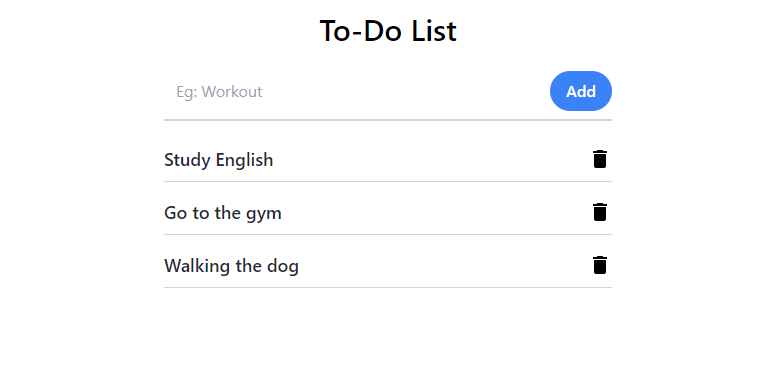

# GlobalTodo - A Universal Todo App

GlobalTodo is a universal todo application designed to help you manage your tasks effortlessly, no matter where you are. Stay organized, track your to-dos, and boost your productivity with GlobalTodo.

## Features

- Create and manage tasks with ease.
- Remove completed or unwanted tasks.
- Save your tasks in local storage for easy access.

## Demo

## Coming Soon

GlobalTodo is continuously improving. Here's a sneak peek at what's coming in the near future:

- **Organize** tasks into customizable to-do lists.
- **Mark** tasks as complete to track your progress.
- **Collaboration**: Soon, you'll be able to collaborate on tasks and to-do lists with others.
- **Dark Mode**: A dark mode theme is in development for users who prefer a darker interface.
- **Export/Import**: Easily export and import your tasks for backup and sharing.

Stay tuned for these exciting updates and enhancements to GlobalTodo!